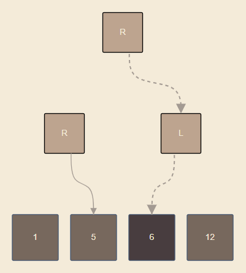
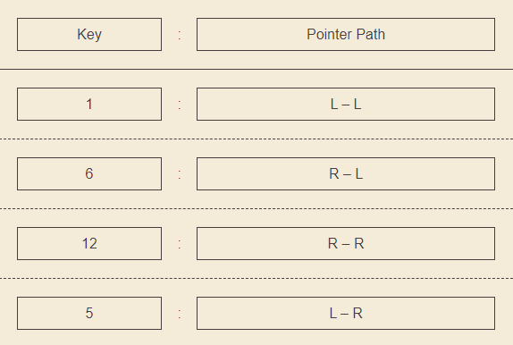

# PLRU Cache Visualizer

## The App | [plru-visualizer](https://plru-visualizer.netlify.app/)

This is a visualizer project that visualizes the Tree Pseudo Least Recently Used (PLRU) cache eviction policy.

It allows user interaction, where the user can:

- `Set the nuumber of memory locations.`
- `Send requests.`
- `Clear cache.`
- `Controll canvas:`
  - `Zoom in and out.`
  - `Fit the tree in the canvas size.`

## Eviction Policy

### `Least Recently Used (LRU)`

The LRU algorithm is an efficient algorithm in software with a time complexity of `O(1)`, but when it comes to hardware it is feasible to implement efficiently.

### `Pseudo Least Recently Used (PLRU)`

A good alternative for LRU is the PLRU algoritm, which is slightly less efficient in software with a time complexity of `O(log n)`, however, it is more efficient to implement in hardware, as it evicts values based on approximate measures rather than keeping track of the exact order.

### `The PLRU Algorithm`

The algorithm uses two data structures, a binary tree with cache memory locations as leaf nodes, and the other nodes are direction nodes used to point to one of the memory locations. the second data structure is a hash map, that takes in the `request-key` as key and the path from the root direction node to a the memory location where the `data` of the `request-key` is stored.

Here is an example where the pointer is pointing to the current least recently used memory location, is the third location holding the data for the key _**`6`**_:

- ## `Tree:`

  

- ## `Hash Map:`

  

---

### Data Requests Use-Cases:

- `Cache isn't Full:`
  - `Cache Hit:` Data is retrieved and then the pointer points back to the location it was pointing at before this request.
  - `Cache Miss:` The newly requested data is stored in the cache at the memory location where the poiner is currently pointing. Then the pointer points to the next next memory location, if the data was placed in the last memory location of the cache, the pointer points to the very first memory location.
- `Cache is Full:`
  - `Cache Hit:` Data is retrieved and then the pointer points to the memory locaction that comes after the location where the requested data is stored.
  - `Cache Miss:` The newly requested data is stored in the location where the poiner is pointing, and then the pointer moves to the next memory location, if the data was placed in the last memory location of the cache, the pointer points to the very first memory location.

_Note: `Cache Hit` means the requested data exists in the cache, otherwise, it is called a `Cache Miss`._

## Learn More

o [Pseudo-LRU - Wikipedia.](https://en.wikipedia.org/wiki/Pseudo-LRU)

o [On the complexity of cache analysis for different replacement policies.](https://hal.archives-ouvertes.fr/hal-01910216/file/cache_analysis_complexity_article.pdf)

---

---

---

# Getting Started with Create React App

This project was bootstrapped with [Create React App](https://github.com/facebook/create-react-app).

## Available Scripts

In the project directory, you can run:

### `npm start`

Runs the app in the development mode.\
Open [http://localhost:3000](http://localhost:3000) to view it in the browser.

The page will reload if you make edits.\
You will also see any lint errors in the console.

### `npm test`

Launches the test runner in the interactive watch mode.\
See the section about [running tests](https://facebook.github.io/create-react-app/docs/running-tests) for more information.

### `npm run build`

Builds the app for production to the `build` folder.\
It correctly bundles React in production mode and optimizes the build for the best performance.

The build is minified and the filenames include the hashes.\
Your app is ready to be deployed!

See the section about [deployment](https://facebook.github.io/create-react-app/docs/deployment) for more information.

### `npm run eject`

**Note: this is a one-way operation. Once you `eject`, you can’t go back!**

If you aren’t satisfied with the build tool and configuration choices, you can `eject` at any time. This command will remove the single build dependency from your project.

Instead, it will copy all the configuration files and the transitive dependencies (webpack, Babel, ESLint, etc) right into your project so you have full control over them. All of the commands except `eject` will still work, but they will point to the copied scripts so you can tweak them. At this point you’re on your own.

You don’t have to ever use `eject`. The curated feature set is suitable for small and middle deployments, and you shouldn’t feel obligated to use this feature. However we understand that this tool wouldn’t be useful if you couldn’t customize it when you are ready for it.

## Learn More

o You can learn more in the [Create React App documentation](https://facebook.github.io/create-react-app/docs/getting-started).

o To learn React, check out the [React documentation](https://reactjs.org/).
